# 📚 Organiza Infinity

Aplicativo web criado para a Hackathon 2025 da Infinity School, com foco em **organização** e **produtividade** dos funcionários da instituição. A plataforma permite gerenciamento de tarefas, calendário interativo, anotações rápidas, visualização de arquivos e integração com o Google Calendar.

---

## 🎯 Objetivo

Facilitar a rotina dos colaboradores da Infinity School com ferramentas que otimizam o dia a dia, como:
- Acesso rápido a recursos internos (planilhas, portal do aluno, etc.)
- Organização de eventos e tarefas por categorias e datas
- Notas rápidas e lembretes visuais
- Integração com o Google Calendar

---

## 🚀 Tecnologias Utilizadas

### 🖥️ Front-End
- HTML5
- CSS3
- JavaScript

### ⚙️ Back-End
- Python 3 com Flask
- SQLite (via SQLAlchemy)

### 🌐 Integrações
- API Google Calendar
- OAuth2 com Google Auth

---

## 🔐 Funcionalidades

- Login e Registro de Usuário
- Dashboard com acesso às funções principais
- Sistema de Tarefas com descrição e exclusão
- Calendário com visualização mensal e eventos categorizados
- Anotações rápidas estilo post-it
- **Central de Arquivos personalizada**:
  - Envio de arquivos com título, link e descrição
  - Visualização organizada por cards com data e link direto
  - Design responsivo com destaque da identidade da Infinity School
- Tela de perfil com foto, cargo e bio
- Integração com Google Calendar (inserção e leitura de eventos)
- Suporte a **modo claro** e **modo escuro**

---

## 📂 Central de Arquivos – Como funciona

A Central de Arquivos pode ser acessada pela rota `/central_arquivos`. A interface foi personalizada com:

- Estilo moderno baseado na paleta da Infinity School
- Campos para título, link do arquivo (Drive, PDF, etc.) e descrição
- Cards com informações organizadas, link clicável e data de envio

> O CSS está localizado em:  
> `static/css/files/file_center.css`

> O HTML principal está em:  
> `templates/file_center.html`

---

## 🧠 Prints das Telas (Modo Claro e Escuro)

> Todas as telas foram testadas nos dois modos visuais para garantir acessibilidade e conforto. As imagens estão localizadas na pasta `/prints`.

### 🏠 Página Inicial (Dashboard)
| Claro | Escuro |
|-------|--------|
| 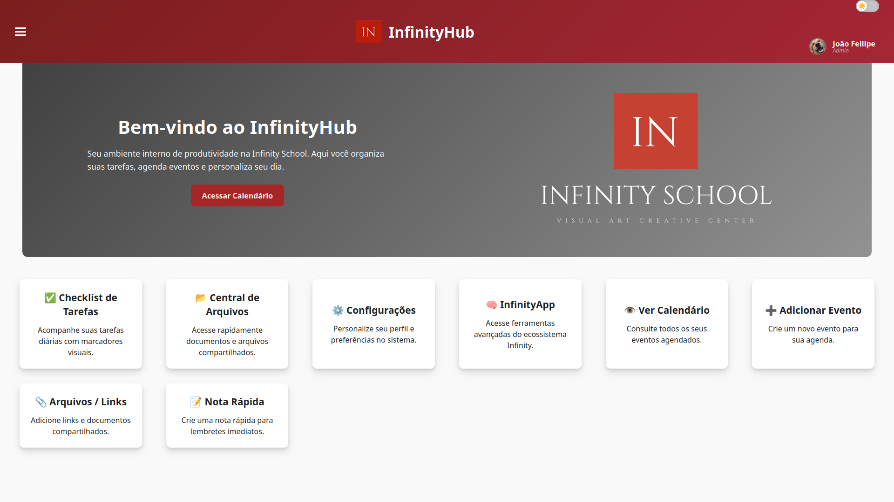 | 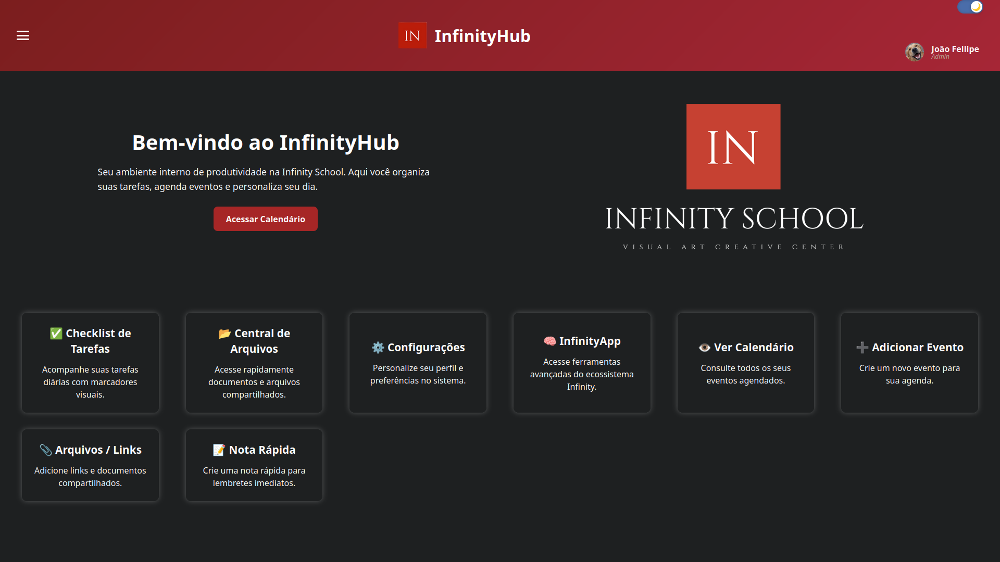 |

---

### 📅 Calendário Interativo
| Claro | Escuro |
|-------|--------|
| 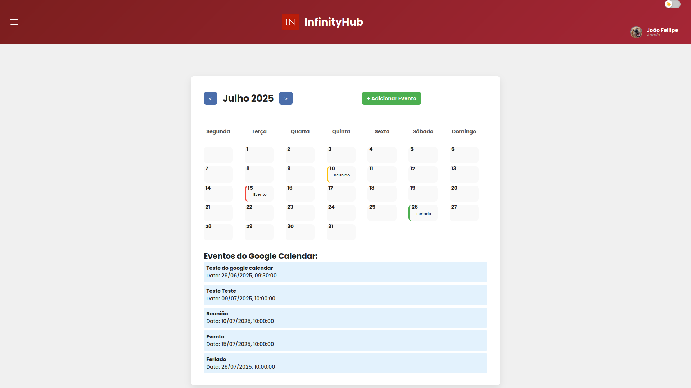 | 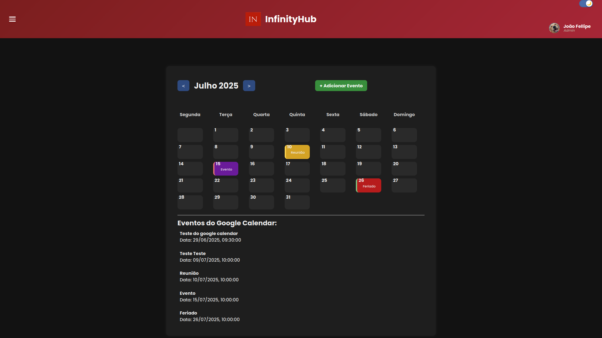 |

---

### ✅ Tarefas
| Claro | Escuro |
|-------|--------|
| 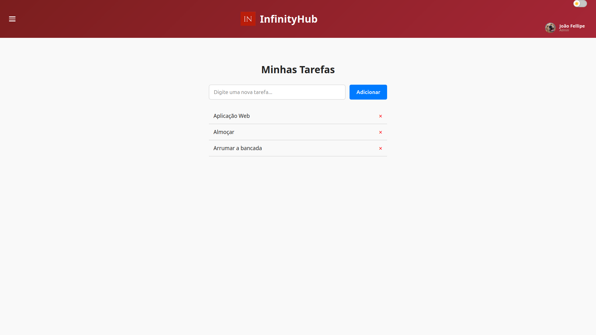 | 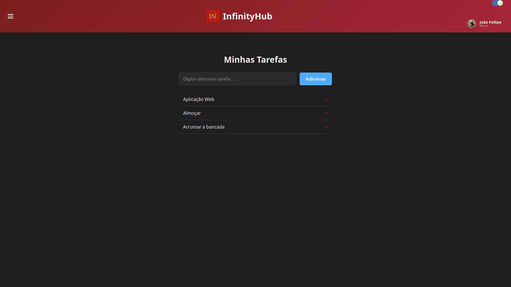 |

---

### 🧠 Anotações Rápidas
| Claro | Escuro |
|-------|--------|
| 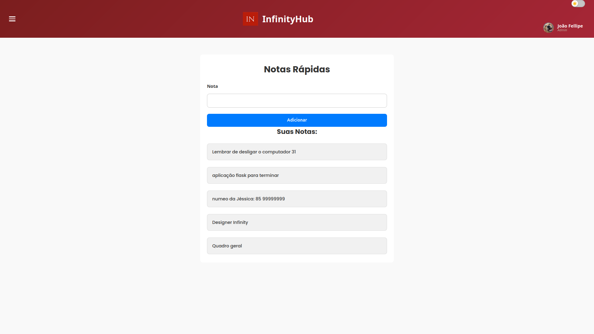 | 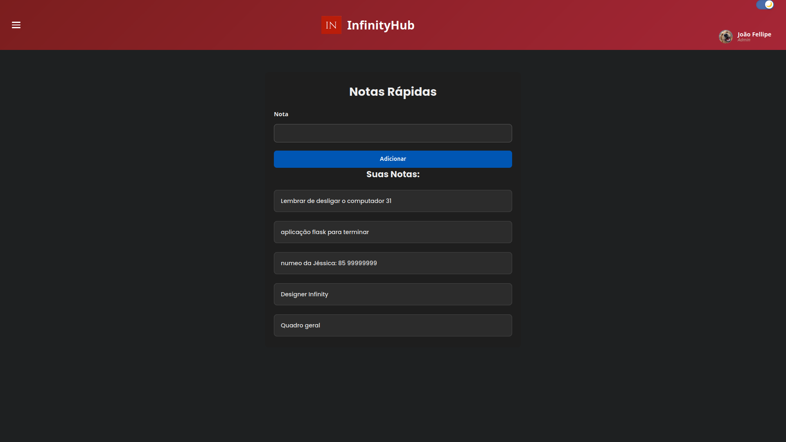 |

---

### 📂 Central de Arquivos
| Claro | Escuro |
|-------|--------|
| 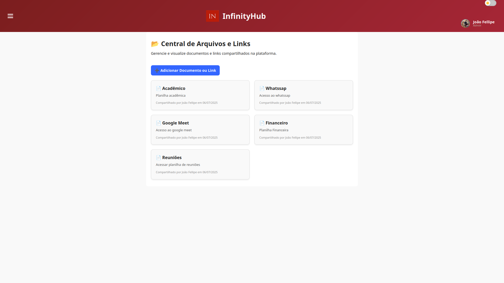 | 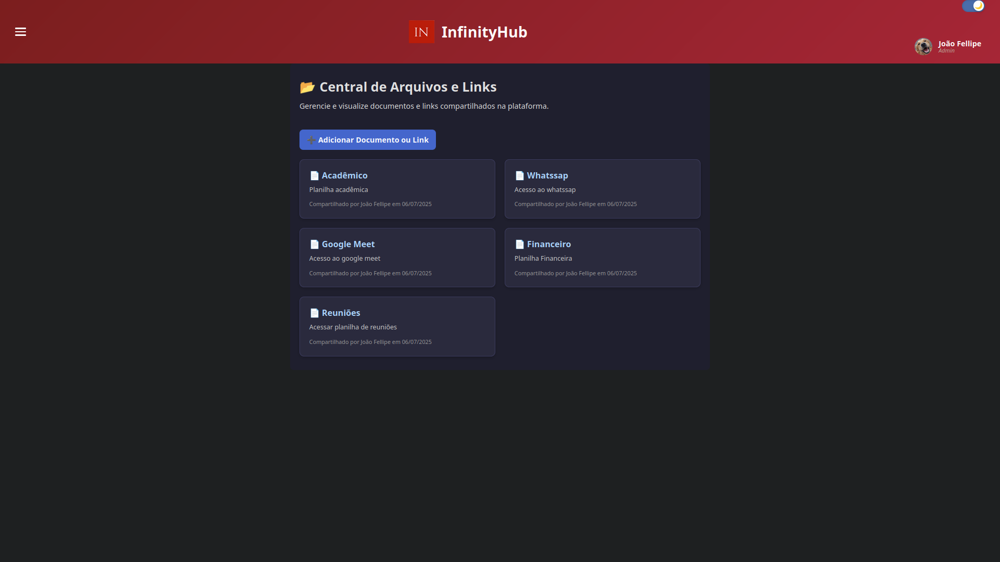 |

---

### 👤 Perfil do Usuário
| Claro | Escuro |
|-------|--------|
| 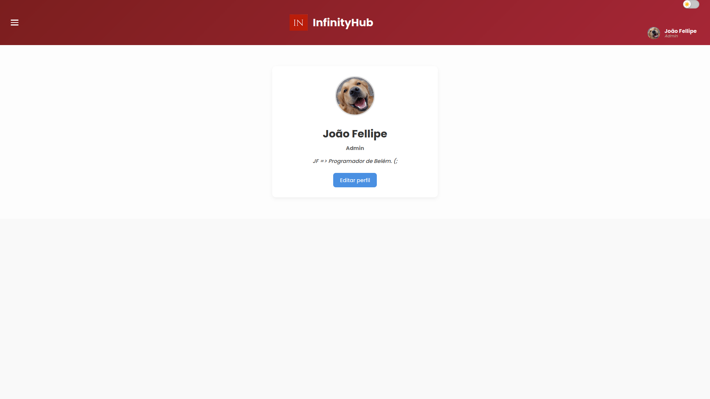 | 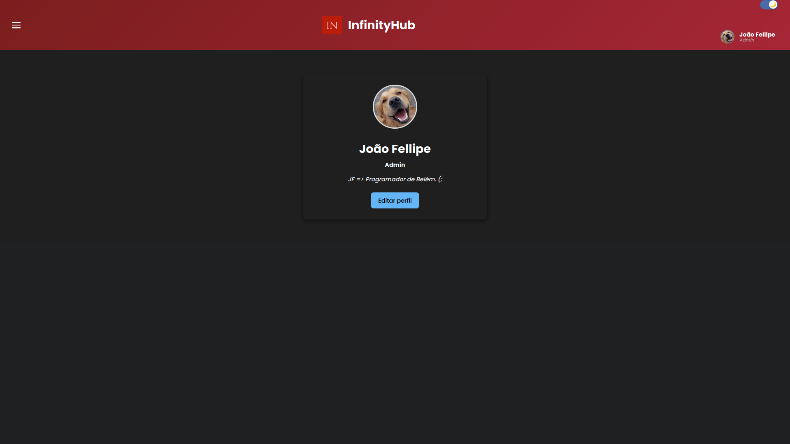 |

---

### 🔐 Login e Registro
| Claro | Escuro |
|-------|--------|
|  | 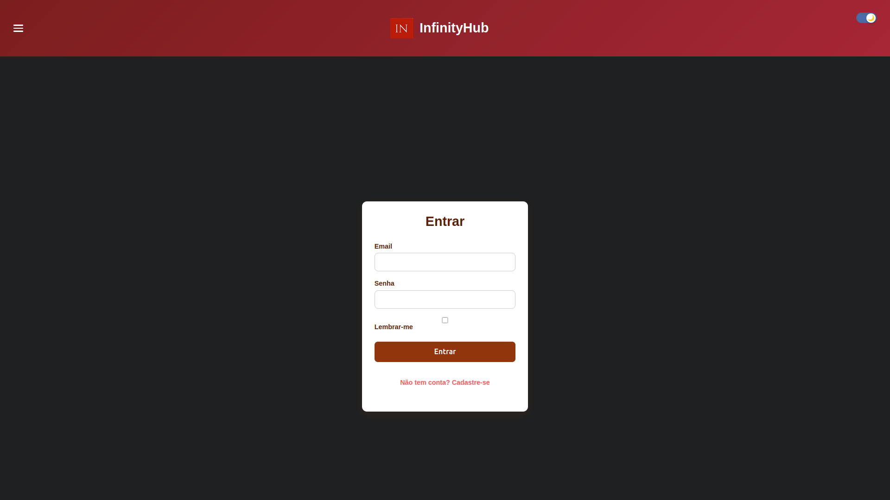 |

---

## 🛠️ Como Rodar Localmente

1. Clone o repositório:
   ```bash
   git clone https://github.com/seu-usuario/seu-projeto.git
   cd seu-projeto

2. Ative o ambiente virtual
    python -m venv venv
    source venv/bin/activate  # Linux/Mac
    venv\Scripts\activate     # Windows

3. Instale as dependências:
    pip install -r requirements.txt

4. Execute a aplicação:
    flask run

5. Acesse no navegador:
    http://localhost:5000